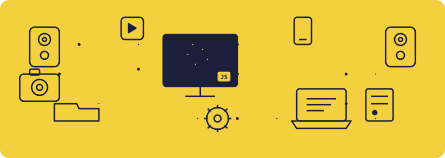

<div align="center">


<br><br>



</div>

<br>

## 🌱 About Me

I'm a Computer Science student at **IIIT Kottayam**, and honestly, the part of building products I love most is figuring out **why** something should exist before I ever think about **how**. That's what keeps pulling me toward **Product Management and Product Design** — understanding a user's problem deeply, shaping the right solution, and then having the technical chops to actually help build it.

I sit at the intersection of **design, strategy, and engineering**. I like sketching an experience out first, validating whether it actually solves the problem, and then either designing it properly or building it myself. Being able to move fluidly between a Figma board, a product roadmap, and a codebase is exactly the kind of product person I'm trying to become.

Lately I've been deep in **AI/ML** — from multi-agent systems that review code, to computer vision pipelines that catch counterfeits, to Android apps that help farmers make smarter calls. I like problems that are a little bit messy and a lot useful — and I care just as much about *why* we're building them as *how*.

```txt
const adhil = {
    role: "Aspiring Product Manager & Product Designer | Engineer at heart",
    interests: ["Product Strategy", "UX/Product Design", "0-to-1 Building", "AI/ML"],
    currentlyLearning: ["Product thinking & PM frameworks", "Agentic AI systems", "Computer Vision"],
    productPhilosophy: "understand the user, design the right thing, build it solid, ship it real",
    funFact: "I'll happily rebuild a UI three times just to get the motion right 🎨"
};
```

<div align="center">

</div>

<br>

## 🎯 What I'm Focused On

<table>
<tr>
<td width="33%" align="center" valign="top">

### 📋 Product Management
Thinking in problems, not just features — user research, prioritization, roadmapping, and shipping things people actually want.

</td>
<td width="33%" align="center" valign="top">

### 🎨 Product Design
Wireframes to high-fidelity prototypes — designing flows that feel obvious in hindsight, with motion and detail that make an interface feel alive.

</td>
<td width="33%" align="center" valign="top">

### ⚙️ Engineering
The technical fluency to build what I design and speak the same language as the engineers I'd be working with.

</td>
</tr>
</table>

<br>

## 🛠️ Tech Stack

<div align="center">

**Languages & Frameworks**


**Data, Infra & Tools**


**AI / ML**


</div>

<br>

## 🚀 Things I've Built

<table>
<tr>
<td width="50%" valign="top">

### 🏫 [campus-Buddy](https://github.com/aadhii-i/campus-Buddy)
A one-stop campus companion — event management, a lost & found board, a community feed, placement updates, and academic resources, all built to make campus life a little less chaotic.
<br>`JavaScript`

</td>
<td width="50%" valign="top">

### 🚜 [IntelliFarm](https://github.com/aadhii-i/IntelliFarm)
An Android app that gives farmers an AI edge: crop assistance, real-time weather forecasts, market price analytics, digital commerce, and precision-farming tools, all in one pocket-sized app.
<br>`Kotlin`

</td>
</tr>
<tr>
<td width="50%" valign="top">

### 🤖 [multi-agent-code-review-ai](https://github.com/aadhii-i/multi-agent-code-review-ai)
A cloud-native FastAPI app where a squad of AI agents reviews your code together — running Ruff, ESLint, and Bandit, then layering LLM reasoning on top for genuinely useful, human-readable feedback.
<br>`Python` `FastAPI`

</td>
<td width="50%" valign="top">

### 🔐 [Hologram-AUTHENTICATION](https://github.com/aadhii-i/Hologram-AUTHENTICATION)
A computer vision pipeline that tells real security holograms from fakes by analyzing the shifting three-channel optical effect across a short video sequence — catching what the eye might miss.
<br>`Python` `OpenCV`

</td>
</tr>
<tr>
<td width="50%" valign="top">

### 🔗 [zenLink](https://github.com/aadhii-i/zenLink)
A production-ready URL shortener done properly: JWT auth, custom aliases, click analytics, QR code generation, and a full Docker deployment, built on FastAPI, React, PostgreSQL, and Redis.
<br>`FastAPI` `React` `PostgreSQL` `Redis`

</td>
<td width="50%" valign="top">

### 💓 [Pulse](https://github.com/aadhii-i/Pulse--AI-health-tracker-design-)
A product design concept for an AI-powered health tracker — exploring how a clean, calming interface can make daily health tracking feel effortless instead of like a chore.
<br>`HTML` `Design`

</td>
</tr>
</table>

<br>

## 📊 GitHub Stats

<div align="center">


</div>

<div align="center">

</div>

<div align="center">

</div>

<br>

## 🤝 Let's Connect

<div align="center">

<a href="https://github.com/aadhii-i"></a>
<a href="https://www.linkedin.com/in/aadhiiii"></a>
<a href="https://drive.google.com/file/d/15AgdqeN3le32pMQy7uMFNzyh7CwSev-0/view?usp=sharing"></a>

<br><br>


</div>


